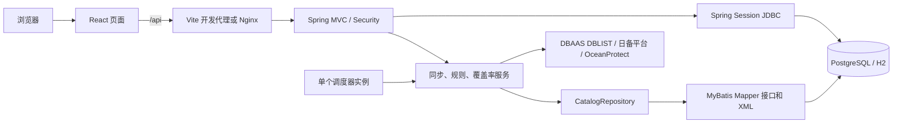

# 数据库备份管理平台

一个用于汇总数据库资产、同步备份平台记录并按策略检查备份完整性的 Web 系统。后端使用 **JDK 8、Spring Boot 2.7 和 MyBatis**，前端使用 **React**；本地演示使用 H2 文件数据库，正式部署使用 PostgreSQL 14。

系统目前管理数据库资产、备份**元数据和规则检查结果**，不保存备份文件本身。数据库资产来自 DBAAS 的 `DBLIST` 接口，备份记录来自日备平台及 OceanProtect；触发备份接口尚未实现。

## 5 分钟本地运行

### 环境要求

- Windows PowerShell 5.1 或更高版本
- JDK 8
- Node.js 20.19+ 或 22.12+
- pnpm

仓库自带 Maven Wrapper，无需单独安装 Maven。第一次构建后端和安装前端依赖时需要访问依赖仓库。

如果电脑中有多个 JDK，可以在项目根目录新建不会提交到 Git 的 `.local-toolchain.ps1`：

```powershell
$env:BACKUP_MANAGER_JAVA_HOME = 'C:\path\to\jdk8'
# 可选：指定 Maven 本地仓库
$env:BACKUP_MANAGER_MAVEN_REPO = 'C:\path\to\maven-repository'
```

### 启动步骤

在项目根目录依次执行：

```powershell
# 1. 编译后端并执行后端测试
powershell.exe -NoProfile -ExecutionPolicy Bypass -File .\scripts\build-backend.ps1

# 2. 启动后端，保持此窗口运行
powershell.exe -NoProfile -ExecutionPolicy Bypass -File .\scripts\run-local-backend.ps1
```

另开一个 PowerShell 窗口：

```powershell
# 3. 安装依赖并启动前端
powershell.exe -NoProfile -ExecutionPolicy Bypass -File .\scripts\run-local-frontend.ps1
```

打开 <http://127.0.0.1:5173/>。后端监听 `127.0.0.1:8080`，Vite 会把 `/api` 和 `/actuator` 转发到后端。

本地脚本不会自动读取 `.env`。需要连接 DBAAS 时，在启动后端的 PowerShell 窗口先设置 `DBAAS_ASSET_URL` 和 `DBAAS_ASSET_TOKEN` 环境变量；仅查看演示数据时可以不配置。

首次启动时，本地脚本会：

1. 创建随机管理员密码并写入根目录的 `.local-credentials`；
2. 启用 `local` Profile，使用 `data/backup_manager.mv.db`；
3. 默认设置 `APP_DEMO_SEED=true`，幂等生成 72 个演示数据库和 3,556 条目标演示记录。

使用 `.local-credentials` 中的账号登录。该文件和 `data/` 均已被 Git 忽略。若数据库中已有历史记录，页面总数可能大于上述演示数据规模。

## 已实现功能

- 多用户登录，支持 `ADMIN` 和 `VIEWER` 两种角色，登录会话存放在数据库中。
- 数据库资产列表、服务端多字段搜索、框架及监控状态筛选、分页浏览，适合数万条资产。
- DBAAS `DBLIST` 数据库资产分页同步，每天北京时间 00:00 定时拉取，也支持管理员手动同步。
- 数据库详情与资产信息维护，包括 DBID、标签、等级、框架、版本、子系统、开发人员、DBA、服务单元和建库日期。
- 按数据库、日期范围、备份类型和状态查询历史备份记录。
- 备份日历，按月查看每天的备份数量和明细。
- 日备、月备、年备计划矩阵及缺失检查。
- 日备平台分页同步，以及 OceanProtect 月备、年备副本同步。
- 自动调度和管理员手动同步，保留同步批次、计数及错误信息。
- 管理员配置规则、登记数据库、维护资产信息和创建用户。
- 仪表盘展示最近 7 天的缺失、待完成和日期待核记录。

当前功能边界：

- 备份触发接口尚未接入。
- `retention_days` 是页面展示和规则核验窗口，不会删除备份平台上的文件。
- `DBLIST` 返回的有效资产会进入数据库目录，因此即使尚无备份记录也能显示在检查范围内；没有出现在资产接口中的数据库仍可由管理员登记。
- 系统根据接口元数据判断备份是否满足规则；实际备份文件是否仍存在，需要上游提供当前备份清单或文件核验接口。

## 技术栈

| 层级 | 技术 |
| --- | --- |
| 后端 | JDK 8、Spring Boot 2.7.18、Spring MVC、Spring Security、Spring Session JDBC、Actuator |
| 持久化 | MyBatis Spring Boot Starter 2.3.2、XML Mapper、Flyway |
| 数据库 | PostgreSQL 14；本地 H2 2.2.224（PostgreSQL 兼容模式） |
| 前端 | React 19、Vite 7 |
| 前端容器 | Node.js 22、pnpm 11.19、Nginx 1.27 |
| 部署 | Docker Compose |

## 系统架构



`CatalogRepository` 是业务层的持久化门面，负责数据库自动登记、备份幂等写入和同步记录主键回填。SQL 位于 `src/main/resources/mapper/`，项目不使用 JPA，业务类中也没有直接编写 `JdbcTemplate` SQL。

Flyway 负责表结构和基础数据：

- `src/main/resources/db/migration/`：PostgreSQL 迁移；
- `src/main/resources/db/local/`：本地 H2 迁移。

修改表结构时，应为两套数据库新增相同版本号的迁移文件。已经执行过的历史迁移不能直接修改，否则现有环境会出现 Flyway 校验失败。

## 项目目录

```text
backup-manager/
├─ src/main/java/com/example/backupmanager/
│  ├─ ApiController.java          HTTP API
│  ├─ BackupSyncService.java      日备与 OceanProtect 同步、定时任务
│  ├─ DbaasAssetSyncService.java  DBAAS 资产同步与 0 点调度
│  ├─ RuleService.java            指定日期范围的规则检查
│  ├─ CoverageService.java        详情页计划矩阵计算
│  ├─ CatalogRepository.java      业务持久化门面
│  └─ *Mapper.java                MyBatis Mapper 接口
├─ src/main/resources/
│  ├─ mapper/*.xml                查询与写入 SQL
│  ├─ db/migration/               PostgreSQL Flyway 迁移
│  ├─ db/local/                   H2 Flyway 迁移
│  ├─ application.yml             通用配置
│  └─ application-local.yml       本地 H2 配置
├─ src/test/                      后端单元与集成测试
├─ frontend/                      React 前端及 Nginx 配置
├─ scripts/                       Windows 构建、运行和 H2 迁移脚本
├─ compose.yaml                   PostgreSQL、后端、调度器和前端
├─ backend.Dockerfile             JDK 8 后端镜像
└─ pom.xml                        Maven 与 Java 8 配置
```

## 核心数据表

| 表 | 用途 | 关键字段 |
| --- | --- | --- |
| `app_user` | 应用账号 | `username`、BCrypt `password_hash`、`role`、`enabled` |
| `database_catalog` | 数据库资产和监控起点 | `name`、`monitor_from`、`active` 及各资产字段 |
| `dbaas_asset` | DBAAS 资产原始记录 | `external_id`、`db_name`、`logicdb_code`、`ldbid`、`valid`、`raw_data`、`last_seen_run_id`、首次及最近同步时间 |
| `backup_record` | 上游备份记录 | `database_id`、`kind`、`external_id`、`backup_date`、`date_inferred`、`event_time`、`status`、`raw_data` |
| `backup_rule` | 三类规则 | `kind`、`enabled`、`grace_days`、`retention_days` |
| `sync_run` | 同步批次 | `kind`、开始/结束时间、状态、拉取数、保存数和错误信息 |
| `SPRING_SESSION*` | 登录会话 | Spring Session JDBC 标准字段 |

`backup_record` 通过 `(kind, external_id)` 唯一约束实现同一上游记录的幂等更新。平台凭据不会写入这些表；`raw_data` 保存单条备份记录的原始 JSON，便于追踪字段来源。

`dbaas_asset.external_id` 对应 DBLIST 的 `ID`，重复同步会更新同一资产的原始 JSON 和最近同步时间。资产通过 `DBNAME` 与 `database_catalog.name` 对应，并将上游 `ID` 绑定到 `asset_external_id`；同名资产的原始记录都会保留，目录只对应其中一个 ID。`DBID`、`LEVEL`、`APP_FRAMEWORK`、`DBVERSION`、`CMBSYSCODE`、开发人员、DBA、服务单元及建库日期等字段会同步到目录。上游字段为空时保留目录中原有的对应值。完整同步后，本次未出现的资产会标记为无效，对应目录会停用；如果同名的其他有效资产仍在清单中，目录会改绑到该资产。中途失败不会将旧清单批量停用。

## 规则口径

默认规则由 Flyway 初始化：

| 类型 | 计划日 | 默认启用 | 宽限期 | 核验窗口 |
| --- | --- | --- | --- | --- |
| 日备 `daily` | 每天 | 是 | 2 天 | 7 天 |
| 月备 `monthly` | 每月 1 日 | 否 | 2 天 | 365 天 |
| 年备 `yearly` | 每年 12 月 31 日 | 否 | 2 天 | 自监控开始以来，永久 |

判断规则如下：

- 计划日当天及之后 2 天为完成窗口；在 `计划日 + 2 天` 当天仍是待完成，当前日期超过该截止日才判定缺失。
- `successed` 为成功，`DISPATCHING` 为进行中，`cancel` 为取消或失败，比较时不区分大小写。
- 一个成功记录只能覆盖一个计划格子。
- 日备必须归属于自己的计划日，不会用次日备份掩盖前一天的缺口。
- 月备、年备允许宽限期内在非计划日完成，并匹配到对应计划日。
- 数据库的核验起点取 `monitor_from` 和 `created_on` 中较晚的日期，不要求新库补齐建库前的备份。
- 未启用的规则显示为未核验；演示库仍用模拟数据展示月备和年备矩阵。

详情矩阵中：黄色表示成功，红色表示缺失或失败，蓝色表示进行中，灰色表示仍在宽限期、日期待核或规则未启用。

### 备份日期的准确性

日备接口中的 `time` 是**记录更新时间**。只有记录包含 `backupDate`、`backup_date` 或 `date` 时，系统才把日期视为明确的计划日期。缺少这些字段时，系统会从 `time` 推定日期并设置 `date_inferred=true`；这类成功记录显示“日期待核”，不会被当作确认成功。

如果上游不提供稳定的 `id`、`backupId` 或 `taskId`，系统会根据数据库名、更新时间和状态派生 ID。此时同一任务的状态变化可能形成多条记录，正式联调时应优先要求上游提供稳定任务 ID。

## Docker Compose 部署

Docker 部署包含四个服务：

- `db`：PostgreSQL 14；
- `backend`：处理 Web API，定时任务关闭；
- `scheduler`：运行同一完整后端应用，启用定时同步且不向宿主机发布端口；
- `frontend`：Nginx 托管 React 静态文件并代理 API。

只有 `frontend` 对宿主机发布端口；`backend` 的 8080 端口仅在 Compose 网络内开放。

### 1. 创建配置

```powershell
Copy-Item .env.example .env
```

至少替换 `.env` 中的：

- `DB_PASSWORD`：PostgreSQL 强密码；
- `BOOTSTRAP_ADMIN_USER`：首个管理员用户名；
- `BOOTSTRAP_ADMIN_PASSWORD`：至少 12 位，且不能以 `replace-` 开头。

首次启动空数据库时必须保留两个 `BOOTSTRAP_ADMIN_*` 变量。只有 `app_user` 中已有账号后，才可以删除管理员密码并重启。需要启用资产同步时，在 `.env` 中填写 `DBAAS_ASSET_URL` 和 `DBAAS_ASSET_TOKEN`；没有使用的平台配置应留空，不要保留示例占位值。Compose 的 `backend` 和 `scheduler` 服务通过 `env_file: .env` 读取这些变量。

### 2. 构建并启动

```powershell
docker compose up -d --build
docker compose ps
```

打开 `http://服务器地址:8080/`。修改 `APP_PORT` 可以改变宿主机端口。

健康检查：

```powershell
curl.exe -fsS http://127.0.0.1:8080/actuator/health
```

查看日志：

```powershell
docker compose logs -f backend scheduler
```

后端 Dockerfile 为缩短镜像构建时间使用 `-DskipTests`。发布前应先在开发或 CI 环境执行完整测试。

### 多实例

Web 后端可以横向扩展，登录会话由 PostgreSQL 共享：

```powershell
docker compose up -d --scale backend=2
```

调度器只能保持一个实例，以免重复执行平台同步。Compose 中仅 `scheduler` 设置 `APP_SCHEDULER_ENABLED=true`。

### PostgreSQL 版本说明

当前 Compose 使用 PostgreSQL 14。PostgreSQL 17 创建的数据卷不能直接挂载给 PostgreSQL 14，PostgreSQL 不支持数据目录原地降级。应先在 PostgreSQL 17 环境使用 `pg_dump -Fc` 导出自定义格式备份，再创建新的 PostgreSQL 14 数据卷并通过 `pg_restore` 恢复；如果导出的是纯 SQL 文件，则使用 `psql` 导入。确认逻辑备份和恢复结果前不要删除原数据卷。

## 配置说明

所有生产凭据均应通过环境变量或受控密钥系统提供，不要写入源码、README 或提交到 Git。

### 应用与数据库

| 环境变量 | 默认值 | 说明 |
| --- | --- | --- |
| `DB_URL` | `jdbc:postgresql://localhost:5432/backup_manager` | JDBC 地址 |
| `DB_USER` | `backup_manager` | 数据库用户 |
| `DB_PASSWORD` | 空 | 数据库密码；Compose 中必填 |
| `BOOTSTRAP_ADMIN_USER` | 空 | 空用户表首次启动时创建的管理员 |
| `BOOTSTRAP_ADMIN_PASSWORD` | 空 | 首个管理员密码，至少 12 位 |
| `COOKIE_SECURE` | `false` | HTTPS 部署时设为 `true` |
| `APP_SCHEDULER_ENABLED` | `false` | 是否启用自动同步 |
| `BACKUP_SYNC_CRON` | `0 0 6 * * *` | Spring Cron，北京时间每天 06:00 |
| `DBAAS_ASSET_CRON` | `0 0 0 * * *` | 资产同步 Spring Cron，北京时间每天 00:00 |
| `APP_DEMO_SEED` | `false` | 仅 `local` Profile 生效的演示数据开关 |
| `APP_PORT` | `8080` | Compose 前端发布端口 |

会话默认有效期为 12 小时。`BOOTSTRAP_ADMIN_*` 只在 `app_user` 为空时使用，已有用户时不会覆盖现有密码。

### DBAAS 数据库资产接口

| 环境变量 | 默认值 | 说明 |
| --- | --- | --- |
| `DBAAS_ASSET_URL` | 空 | `DBLIST` POST 接口完整地址 |
| `DBAAS_ASSET_TOKEN` | 空 | Bearer Token |
| `DBAAS_ASSET_PAGE_SIZE` | `500` | 每页数量，范围 1–2000 |
| `DBAAS_ASSET_MAX_PAGES` | `1000` | 单次最大页数，范围 1–10000 |

地址或 Token 未配置时，0 点任务会跳过；管理员手动同步则会返回配置错误。Token 通过环境变量传入，不写入数据库或日志。

### 日备接口

| 环境变量 | 默认值 | 说明 |
| --- | --- | --- |
| `BACKUP_DAILY_URL` | 空 | 日备 POST 接口完整地址 |
| `BACKUP_DAILY_TOKEN` | 空 | Bearer Token |
| `BACKUP_DAILY_DATA_PATH` | 自动识别 | 返回 JSON 中列表的点分路径，如 `data.items` |
| `BACKUP_DAILY_PAGE_SIZE` | `20000` | 每页数量，范围 1–20000 |
| `BACKUP_DAILY_MAX_PAGES` | `100` | 最大页数，范围 1–1000 |

### OceanProtect

| 环境变量 | 默认值 | 说明 |
| --- | --- | --- |
| `OCEANPROTECT_BASE_URL` | 空 | 平台根地址，不包含 `/v1` |
| `OCEANPROTECT_USERNAME` | 空 | 平台账号 |
| `OCEANPROTECT_PASSWORD` | 空 | 平台密码 |
| `OCEANPROTECT_AUTH_TYPE` | `STORAGE_SYSTEM` | 认证类型 |
| `OCEANPROTECT_USER_TYPE` | `common` | 用户类型 |
| `OCEANPROTECT_LANGUAGE` | `1` | 语言编号，允许 1 或 2 |
| `OCEANPROTECT_PAGE_SIZE` | `100` | 副本每页数量，范围 1–199 |
| `OCEANPROTECT_SLA_PAGE_SIZE` | `100` | SLA 每页数量，范围 1–1000 |
| `OCEANPROTECT_MAX_PAGES` | `1000` | 单次分页上限，范围 1–10000 |

## 数据库资产与备份同步

### DBAAS 数据库资产

启用单个调度器实例并配置 DBAAS 环境变量后，系统默认在 `Asia/Shanghai` 时区每天 00:00 调用 `DBLIST`。请求从第 0 页开始，按 `pagination.total` 翻页，每页提交：

```json
{
  "pageIndex": 0,
  "pageSize": 500,
  "customParams": { "VALID": "Y" }
}
```

`pageIndex` 随页数增加，`pageSize` 由 `DBAAS_ASSET_PAGE_SIZE` 控制。请求头使用 `Authorization: Bearer <DBAAS_ASSET_TOKEN>` 和 `Content-Type: application/json`。响应需包含 `code: 0`、`pagination.total` 和 `data` 数组；`ID` 与 `DBNAME` 是每条资产必需字段。系统按 `ID` 更新 `dbaas_asset`，保存每条原始 JSON，再按 `DBNAME` 登记或更新 `database_catalog`。新增目录项的监控起点优先取上游 `DB_CREATE_DATE`（未来日期按同步当天处理），缺少建库日期时取同步当天；即使没有备份记录，也可纳入规则检查。

同步批次以 `assets` 写入 `sync_run`，记录拉取数、新增资产数和错误。相同批次出现重复 ID、未读完资产就遇到空页或达到最大页数时，批次会标记失败。分页中途失败时，已经逐条写入的资产不会回滚，下次同步会幂等更新；旧资产的批量失效只在完整同步成功后执行。管理员可在“同步记录”页面点击“同步数据库资产”，或调用 `POST /api/admin/sync/assets` 手动执行。PostgreSQL 同步锁会阻止多实例同时执行资产同步。DBLIST 仅请求 `VALID=Y`；上游后来不再返回的资产仍保留原始记录供审计，但会在成功完成整批同步后被标记为无效。

### 日备平台

系统从第 1 页开始向 `BACKUP_DAILY_URL` 发送 POST 请求：

```json
{
  "pageIndex": 1,
  "pageSize": 20000,
  "customParams": {}
}
```

请求头使用 `Authorization: Bearer <BACKUP_DAILY_TOKEN>`。每条记录至少需要：

- `dbname`：数据库名；
- `status`：备份状态；
- `time`：记录更新时间。

系统支持顶层数组，以及 `data.records`、`data.rows`、`data.list`、`data`、`records`、`rows`、`list`、`result.records`、`result.rows`、`result.list`。若实际列表位于其他路径，设置 `BACKUP_DAILY_DATA_PATH`。

同步遇到空页时正常结束；如果平台重复返回相同页面，系统会停止并记录错误，避免无限拉取。

### OceanProtect 月备与年备

同步过程如下：

1. `POST /v1/auth/token` 获取 `X-Auth-Token`；
2. 从第 0 页分页调用 `GET /v1/slas`，识别 `policy_list[].schedule.trigger_action` 为 `month` 或 `year` 的 SLA；
3. 按 SLA 名称调用 `GET /v1/copies`；
4. 解析 `resource_name`、`uuid`、`display_timestamp`、`status`、`sla_name`、`generated_by` 和 `sla_properties`；
5. 将能唯一识别为月备或年备的副本幂等写入。

`generated_by` 接受 `sla` 或 `backup`（不区分大小写），归档或复制副本会被排除。`available` 状态入库时转换为 `successed`。如果同一 SLA 包含多个备份调度而副本无法关联到具体调度，系统会把它计为“策略类型不明确”，不会根据 SLA 名称猜测。

分页请求收到 401 或 403 时会重新认证并重试一次。同步前仍需与真实平台确认 Endpoint、证书、服务账号、字段枚举，以及 `resource_name` 是否与本系统数据库名一致且唯一。

自动调度使用 `Asia/Shanghai` 时区：资产同步默认每天 00:00 执行，日备和 OceanProtect 同步按 `BACKUP_SYNC_CRON` 默认每天 06:00 执行。管理员也可以在“同步记录”页面分别手动执行。

## 主要 API

除健康检查、获取 CSRF Token 和登录外，`/api/**` 都需要登录；`/api/admin/**` 仅允许管理员。修改请求受 CSRF 保护，浏览器客户端需要先读取 `/api/auth/csrf`，并把 Token 放入 `X-XSRF-TOKEN` 请求头。

| 方法 | 路径 | 权限 | 用途 |
| --- | --- | --- | --- |
| `GET` | `/actuator/health` | 公开 | 健康检查 |
| `GET` | `/api/auth/csrf` | 公开 | 获取 CSRF Token |
| `POST` | `/api/auth/login` | 公开 | 表单登录，字段为 `username`、`password` |
| `GET` | `/api/auth/me` | 登录 | 当前用户和管理员标识 |
| `POST` | `/api/auth/logout` | 登录 | 退出登录 |
| `GET` | `/api/dashboard` | 登录 | 仪表盘汇总 |
| `GET` | `/api/databases?q=` | 登录 | 数据库列表；`q` 仅按数据库名模糊查询 |
| `GET` | `/api/databases/page?q=&page=0&size=20` | 登录 | 数据库分页列表，支持 `backupState`、`monitorState`、`framework` 筛选；`q` 搜索名称、DBID、资产 ID、标签、子系统、开发人员、DBA 和服务单元 |
| `GET` | `/api/databases/frameworks` | 登录 | 已有应用框架选项 |
| `GET` | `/api/databases/{id}` | 登录 | 数据库详情 |
| `GET` | `/api/databases/{id}/coverage` | 登录 | 日/月/年计划矩阵 |
| `GET` | `/api/backups` | 登录 | 备份查询，支持 `databaseId`、`date`、`from`、`to`、`kind`、`status`、`page`、`size` |
| `GET` | `/api/calendar?year=&month=` | 登录 | 月度备份数量 |
| `GET` | `/api/rules` | 登录 | 规则列表 |
| `GET` | `/api/checks?databaseId=&from=&to=` | 登录 | 指定数据库规则检查，起止日期跨度不超过 366 天 |
| `GET` | `/api/sync-runs` | 登录 | 最近 50 次同步记录 |
| `POST` | `/api/admin/databases` | 管理员 | 登记数据库 |
| `PUT` | `/api/admin/databases/{id}/metadata` | 管理员 | 更新资产信息 |
| `PUT` | `/api/admin/rules/{id}` | 管理员 | 更新规则 |
| `POST` | `/api/admin/sync/daily` | 管理员 | 立即同步日备 |
| `POST` | `/api/admin/sync/assets` | 管理员 | 立即同步 DBAAS 数据库资产 |
| `POST` | `/api/admin/sync/oceanprotect` | 管理员 | 立即同步月备和年备 |
| `GET` | `/api/admin/users` | 管理员 | 用户列表 |
| `POST` | `/api/admin/users` | 管理员 | 创建用户 |

## 构建与测试

### 后端

Windows：

```powershell
.\mvnw.cmd test
.\mvnw.cmd clean package
```

Linux 或 macOS：

```bash
./mvnw test
./mvnw clean package
```

后端测试包括：

- MyBatis 与 Flyway 的 H2 集成测试；
- DBLIST 的第 0 页起始、`VALID=Y` 过滤、分页与资产幂等落库、完整快照失效及恢复；
- 日备响应结构、字段和时间解析；
- 规则到期日、宽限期、状态和单记录单格匹配；
- OceanProtect 认证、分页、Token 刷新、SLA 分类和副本入库；
- 同步失败记录及数据库自动登记。

### 前端

```powershell
Set-Location frontend
pnpm install --frozen-lockfile
pnpm build
```

前端当前提供 `dev` 和 `build` 脚本，没有独立测试脚本。

## 旧 H2 2.3 数据迁移

`scripts/migrate-local-h2-2.3-to-2.2.ps1` 只用于把**最后由 H2 2.3.232 打开的旧本地文件库**迁移到项目当前使用的 H2 2.2.224。新建数据库、已经迁移过的数据库以及 PostgreSQL 都不能运行该脚本。

迁移前必须：

1. 停止后端和所有 H2 工具；
2. 确认源文件确实来自 H2 2.3.232；
3. 准备 Java 11 或更高版本用于导出，以及 JDK 8 或更高版本用于导入；
4. 保留足够空间存放导出文件和原库备份。

默认迁移 `data/backup_manager.mv.db`：

```powershell
powershell.exe -NoProfile -ExecutionPolicy Bypass -File .\scripts\migrate-local-h2-2.3-to-2.2.ps1 -ConfirmLegacyH2
```

脚本会先用 H2 2.3.232 完整导出，创建带毫秒时间戳的原文件备份，再用 H2 2.2.224 导入并重新打开校验。任一步失败时会尝试删除未完成的新库并恢复原文件。

Spring Boot 3 与 Spring Boot 2.7 的会话序列化格式不兼容，因此脚本会清空 `SPRING_SESSION` 和 `SPRING_SESSION_ATTRIBUTES`；用户、数据库、备份和规则等业务数据保持不变，迁移后所有用户需要重新登录。确认应用和数据正常前，不要删除 `*.before-h2-2.2.224.*.mv.db` 备份。

脚本会自动查找 Java 和两个 H2 Jar。自动查找失败时，可通过 `-SourceH2Jar`、`-TargetH2Jar`、`-SourceJavaPath`、`-TargetJavaPath` 和 `-DatabaseBasePath` 传入**绝对路径**。

## 部署与安全建议

- 正式环境使用 HTTPS 反向代理，并设置 `COOKIE_SECURE=true`。
- 本系统使用 BCrypt 保存密码，使用 JDBC 共享会话，并为修改请求启用 CSRF 防护。
- `.env`、`.local-credentials`、Token 和平台密码不得提交到代码仓库或写入日志。
- 内部 HTTPS 平台使用自签发证书时，将 CA 或服务器证书导入后端 JVM truststore，不要关闭 TLS 校验。
- 只运行一个调度器实例；多个 Web 后端可以共享 PostgreSQL 和登录会话。
- 定期备份 PostgreSQL，并演练 `pg_restore`。
- 生产环境首次同步后，核对数据库名称映射、备份日期、状态枚举和同步计数，再启用月备、年备规则。

## 常见问题

### 后端提示找不到 JAR

先执行：

```powershell
powershell.exe -NoProfile -ExecutionPolicy Bypass -File .\scripts\build-backend.ps1
```

`run-local-backend.ps1` 只负责运行 `target/` 中已有的最新 JAR。

### 构建使用了错误的 Java 版本

执行 `java -version`，并确认 `BACKUP_MANAGER_JAVA_HOME` 或 `JAVA_HOME` 指向 JDK 8。VS Code Java Language Server 可以使用较新 JDK，但项目编译和运行时必须使用 JDK 8；`pom.xml` 中的目标版本为 `1.8`。

### 空数据库启动失败，提示设置管理员账号

设置非空的 `BOOTSTRAP_ADMIN_USER`，并提供至少 12 位且不以 `replace-` 开头的 `BOOTSTRAP_ADMIN_PASSWORD`。用户表中已有账号时，这两个变量不会重置密码。

### 月备或年备全部显示灰色

两类规则默认关闭。先完成真实接口同步并核对结果，再由管理员在规则页面启用。规则关闭时灰色表示“未核验”。

### 成功日备仍显示“日期待核”

检查上游记录是否包含 `backupDate`、`backup_date` 或 `date`。仅有记录更新时间 `time` 时，系统不会把推定日期作为确认成功。

### 同步提示无法识别返回列表

确认接口返回 JSON；如果列表不在系统内置路径中，将它的点分路径写入 `BACKUP_DAILY_DATA_PATH`，例如 `data.items`。

### OceanProtect HTTPS 握手失败

将平台 CA 或服务器证书导入运行后端的 JVM truststore，并检查证书域名、有效期及系统时间。不要通过关闭证书校验解决。

### Docker 升级后 PostgreSQL 无法启动

先检查 `postgres_data` 最初由哪个 PostgreSQL 主版本创建。不同主版本的数据目录不能直接互用，使用对应旧版本启动并通过 `pg_dump`、`pg_restore` 进行逻辑迁移。

### API 返回 403

管理员接口需要 `ADMIN` 角色。对于 POST、PUT 等修改请求，还必须先调用 `/api/auth/csrf`，携带会话 Cookie，并发送 `X-XSRF-TOKEN` 请求头。
